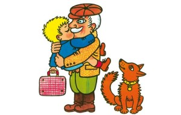

## 1. kapitola

### **Maminak posílá psaní**

Maminka stála u okna a četla psaní od babičky z Koníkovic. Na konci bylo napsáno:

*„Přivezte k nám Honzíka! Našemu dědovi i mně se po něm moc stýská. Vždyť u nás nebyl tak dlouho! Švestky na zahradě už načisto změkly a letní jablka padají. Nemá je kdo sbírat. Punťa běhá po návsi a očichává kluky, který z nich je Honzík. Kocour sedá na sloupku u našich vrátek a vyhlíží, jestli Honzík už přijíždí. Přivezte ho, kloučka, alespoň na několik dní!“*

Maminka se potichu zasmála a obrátila se k Honzíkovi, který si právě hrál na zemi s několika kousky dřeva. Její Honzík. Kluk jako špalík. Tváře měl červené, vlasy mu stály a bříško se mu do kalhot sotva vešlo. „Honzíku,“ řekla maminka, „babička píše, abys přijel do Koníkovic.“ „Babička?“ vykřikl Honzík a hnal se k mamince. Hned jí bral z ruky psaní a chtěl si sám přečíst, co babička píše. „Punťa tě hledá po návsi a kocour se tě nemůže dočkat,“ pokračovala maminka a dala psaní Honzíkovi. „Punťa? Kde je Punťa?“ sháněl se Honzík po svém věrném příteli. Nemohl Punťu mezi tím černým smetím na papíře rozeznat. „Tady je Punťa,“ řekla maminka a ukázala na řádek písmenek. Honzíkovi se řádek nelíbil. Rezatého Punťu mu vůbec nepřipomínal. „A kocour? Ten je tu taky?“ vyzvídal Honzík. Možná že kocour bude vypadat líp. Ale nevypadal. Honzík byl kocourem z babiččina psaní rovněž zklamán. „Dědečkův kocour je černý jako komín,“ řekl určitě Honzík, „a tenhle na bříšku prosvítá. Vypadá spíš jako brouk než kocour.“ „Ty můj malý,“ zasmála se maminka a chtěla Honzíka pochovat. „Vždyť ještě neumíš číst!“ „Já už nejsem malý,“ odpověděl rozhodným hlasem Honzík a na ruku se nedal vzít. Začal se dokonce shánět po svém kabátku, a že se vypraví k babičce. Nasedne do vlaku a pojede. Vydá se na cestu hned, jaképak zdržování!

„Jak chceš, Honzíku,“ zvážněla maminka. „Když si myslíš, že už jsi dost velký, můžeš jet k babičce sám. Já nemám čas, abych tě tam vezla. Víš, co máme u nás práce. A tatínek se vrátí ze stavby až v neděli. Pojedeš sám!“ „Já se nebojím,“ vypjal se Honzík a červené tváře mu zasvítily. „Vezmu si skleněnou kuličku a prut a pojedu k babičce. Honzík začal hledat po kapsách barevnou kuličku. Byl na ni pyšný. Všichni kluci z ulice mu ji záviděli. Honzík se domníval, že bez kuličky nemůže k babičce jet. Rovněž prut se mu zdál nezbytný. Známí kluci nosili prut. Honzík ho chtěl mít taky „Počkej,“ zadržela ho maminka, „jen od nás tolik nepospíchej! Nemůžeš jít do vlaku jen tak s kuličkou a s prutem. Večer ti připravím kufřík, dám tam tvoje věci a pojedeš až zítra. „A kuličku?“ zeptal se Honzík. „Tu tam dám taky.“ „A prut?“ vyzvídal Honzík. „Prut musíš nechat doma. S tím se do vlaku nesmí. Ještě bys tam někomu vypíchl oko!“ řekla maminka takovým hlasem, který Honzík vždycky hned poslechl. Prutu mu ale bylo trochu líto. Připadal si bez něho, jako by ani nebyl žádný kluk. Co dělat? Honzík se musel smířit s pomyšlením, že pojede k babičce bez prutu. Vždyť i tak bude stát tenhle výlet za to!
